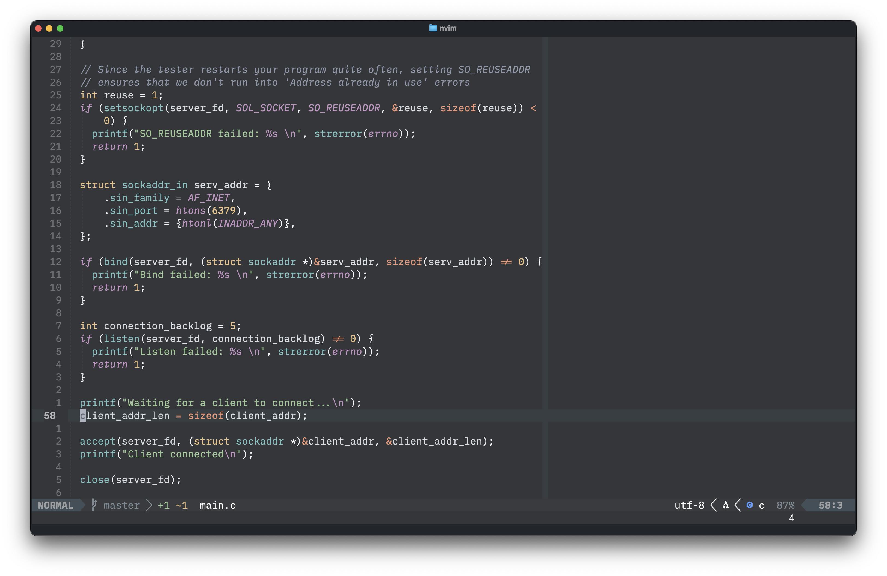

# ultimate-dark-neo.nvim

A Neovim port of the [Ultimate Dark Neo](https://github.com/rubjo/ultimate-dark-neo-zed) Zed theme by [rubjo](https://github.com/rubjo) — _"a muted and pleasant dark theme with some italics to distinguish certain parts of the syntax"_.



## Features

- Dark, muted palette with high-contrast foregrounds for readability
- Selective italics on keywords, constants, booleans, comments, and attributes — matching the original theme exactly
- Full **Treesitter** support (`@` highlight groups)
- **LSP semantic token** highlights (`@lsp.type.*`)
- **LSP diagnostics** — virtual text, underlines, and sign column
- Plugin support out of the box:
  - [gitsigns.nvim](https://github.com/lewis6991/gitsigns.nvim)
  - [indent-blankline.nvim](https://github.com/lukas-reineke/indent-blankline.nvim)
  - [telescope.nvim](https://github.com/nvim-telescope/telescope.nvim)
  - [nvim-cmp](https://github.com/hrsh7th/nvim-cmp)
  - [neo-tree.nvim](https://github.com/nvim-neo-tree/neo-tree.nvim)
  - [which-key.nvim](https://github.com/folke/which-key.nvim)
  - [nvim-notify](https://github.com/rcarriga/nvim-notify)
- Terminal colours (all 16 ANSI slots) taken directly from the original theme

## Palette

| Role                              | Colour    |
| --------------------------------- | --------- |
| Background                        | `#33363a` |
| Dark background (panels, floats)  | `#2d3134` |
| Foreground                        | `#f5f6f8` |
| Comments                          | `#8f97a8` |
| Keywords / Constants / Attributes | `#c396c3` |
| Functions                         | `#7ec2c2` |
| Strings                           | `#9eca99` |
| Numbers / Types                   | `#ecc285` |
| Booleans / Tags / Constructors    | `#e4797e` |
| Operators                         | `#f19776` |
| Properties / Punctuation          | `#ffffff` |
| Info / Links                      | `#7faad5` |
| Errors                            | `#bf616a` |

## Requirements

- Neovim 0.8+
- `termguicolors` enabled (set automatically by the theme)

## Installation

### [lazy.nvim](https://github.com/folke/lazy.nvim)

```lua
{
  "sale87/ultimate-dark-neo.nvim",
  priority = 1000,
  config = function()
    vim.cmd.colorscheme("ultimate-dark-neo")
  end,
}
```

### [packer.nvim](https://github.com/wbthomason/packer.nvim)

```lua
use {
  "sale87/ultimate-dark-neo.nvim",
  config = function()
    vim.cmd.colorscheme("ultimate-dark-neo")
  end
}
```

### Manual

```bash
git clone https://github.com/sale87/ultimate-dark-neo.nvim \
  ~/.local/share/nvim/site/pack/themes/start/ultimate-dark-neo.nvim
```

Then add to your `init.lua`:

```lua
vim.cmd.colorscheme("ultimate-dark-neo")
```

## Credits

- Original **Ultimate Dark Neo** theme — [rubjo/ultimate-dark-neo](https://github.com/rubjo/ultimate-dark-neo)
- Zed port — [rubjo/ultimate-dark-neo-zed](https://github.com/rubjo/ultimate-dark-neo-zed)

## License

MIT
